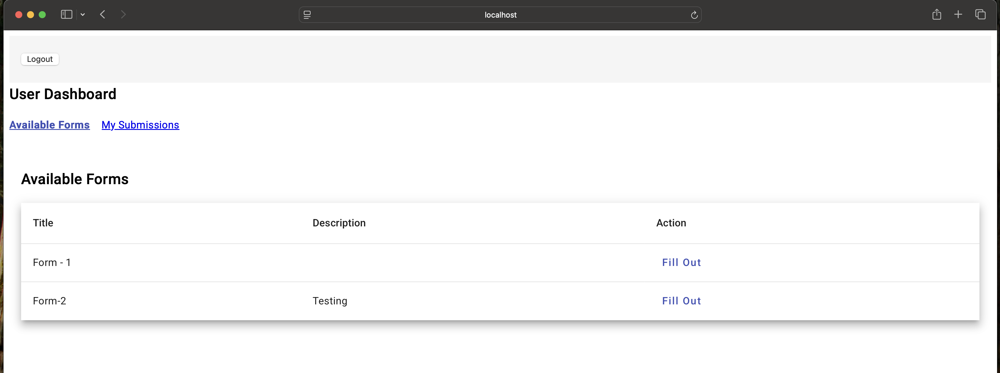

# Part 1: Dynamic Form Builder Application

An Angular-based dynamic form builder with role-based access control (Admin/User) and drag-and-drop functionality.

## Features

- **Role-Based Access Control**
  - Admin: Create, edit, delete forms
  - User: Fill and submit forms

- **Form Builder**
  - Drag-and-drop form field arrangement
  - Support for multiple field types:
    - Text input (single/multi-line)
    - Dropdown select
    - Checkbox groups
    - Radio buttons
    - Date picker
  - Field configuration:
    - Labels, placeholders
    - Required/optional
    - Validation rules
    - Default values

- **Form Management**
  - Create/Edit/Delete forms
  - Preview forms before publishing
  - View form submissions

- **Responsive Design**
  - Works on desktop and mobile devices

## Technologies Used

- Angular 14+
- Angular Material UI
- Reactive Forms
- Drag and Drop (CDK)
- RxJS for state management
- LocalStorage for mock API persistence

## Installation

1. Clone the repository:
   ```bash
   git clone https://github.com/firetechie/Dynamic-Form-Builder-Application.git
   cd Dynamic-Form-Builder-Application

2. Install dependencies:
    npm install

3. Run the application:
    ng serve

4. Open in browser:
    http://localhost:4200


### Usage

Login Credentials

Admin:
Username: admin
Role: Select "Admin" from dropdown
User:
Any username
Role: Select "User" from dropdown


### Key Functionality

Admin Features:

Create forms with drag-and-drop
Configure field properties
Preview forms before saving
Manage existing forms
User Features:

View available forms
Fill out and submit forms
View submission history


----------------------------------------------------------------------------------------------------
## Known Issues & Implementation Challenges

During development, I encountered a few technical challenges that would require additional time/investigation to fully resolve:

### 1. Form Persistence Refresh Issue
- **Symptom**: Saved forms only appear after manual page refresh
- **Root Cause**: The BehaviorSubject state isn't immediately synchronized with localStorage
- **Workaround**: Implemented manual refresh as temporary solution
- **Proposed Fix**: 
  ```typescript
  // In FormService
  saveForm(formData: Partial<Form>): Observable<Form> {
    return this.forms$.pipe(
      take(1),
      switchMap(forms => {
        // ... save logic ...
        return of(savedForm).pipe(
          tap(() => window.location.reload()) // Temporary solution
        );
      })
    );
  }


### 2. Edit Form Rendering Issue

Symptom: Form data doesn't load when accessing via edit URL despite correct ID
Debugging Findings:
Route parameters are correctly captured
Form data exists in localStorage
Current Workaround: Requires navigating away and back
Required Solution:

// In form-builder.component.ts - Admin Level
ngOnInit() {
  this.route.paramMap.pipe(
    switchMap(params => {
      const id = params.get('id');
      return id ? this.formService.getFormById(+id) : of(null);
    })
  ).subscribe(form => {
    // Force reload with setTimeout as temporary fix
    setTimeout(() => this.loadFormData(form), 100);
  });
}


### 3. User Submission Failure

Symptom: Forms appear but submissions fail for User role
Identified Problems:
Missing form ID in submission payload
Auth guard interference

- Temporary Workaround: None currently
- Solution Approach:
      - Need to:-
      - 1. Verify form ID binding in template
      - 2. Adjust auth guard to permit submissions
      - 3. Add role-specific submission handling


### Alternative Implementations Considered

For the form persistence issue, I evaluated:


Decision: Maintained current implementation due to time constraints, with documented workaround.
----------------------------------------------------------------------------------------------------


### Implementation Notes

State Management:
Used BehaviorSubject for shared state
LocalStorage persistence for forms and submissions
Form Validation:
Dynamic validation based on field configuration
Cross-field validation support
Authorization:
Route guards for protected routes
Role-based component rendering
Challenges Overcome:
Drag-and-drop form building
Dynamic form field rendering
Role-based view management


### Testing

Run unit tests:
ng test


### Test coverage includes:

Form builder component
Auth service
Form validation logic
Future Enhancements

Add more field types (file upload, range slider)
Implement form versioning
Add collaborative editing
Implement proper backend API integration


## Application Screenshots

### Login


### New Form 


### Previously Saved Forms


### User View


### Fill Out Form As a User

`
